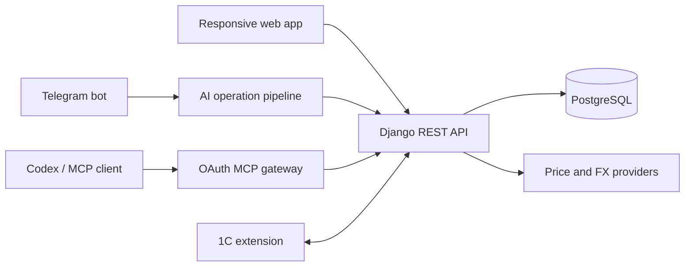

# FrontMoney

**A self-hosted financial command center for everyday money, planning, investments, and AI-assisted workflows.**

[English](README.md) · [Русский](README.ru.md)

[Get started](docs/operations/server-runbook.en.md) · [Documentation](docs/README.md) · [API](moneybackend/README.md) · [Investment module](docs/investment-module.md)

FrontMoney brings cash accounts, budgets, recurring payments, investment portfolios, reports, and automation into one private workspace. Record an expense manually, describe it in plain language, send a bank screenshot, or let an external AI agent work through the authenticated MCP interface—the same financial model stays in control.

## Why FrontMoney

Most finance trackers stop at categorizing transactions. FrontMoney connects the full workflow:

- **Know where your money is** with live wallet balances and a consolidated dashboard.
- **Plan before you spend** with budgets, schedules, projects, and recurring payments.
- **Turn raw banking activity into structured records** using text, screenshots, voice, and AI-assisted classification.
- **Track investments separately and correctly** with positions, cost basis, realized and unrealized P&L, allocation targets, and rebalancing analytics.
- **Bring your own agent** through an OAuth-protected MCP server with 40+ typed finance tools.
- **Keep ownership of the system and the data** with a fully self-hosted Docker deployment.

## Product highlights

### Daily money management

- Wallets for cards, bank accounts, cash, debt, and custom money containers.
- Income, expenses, and transfers with projects and hierarchical cash-flow categories.
- Real-time and historical balances.
- Budgets, budget execution, recurring payments, and payment schedules.
- Cash-flow and budget reports with drill-down details and exports.
- Responsive web interface with light and dark themes.

### AI assistant that acts, not just chats

- Natural-language requests in the web application.
- Bank screenshot recognition for single operations and transaction batches.
- Context-aware follow-up questions when a wallet, category, or date is ambiguous.
- A smart web mode that selects typed tools, reads real application data, and chains several actions.
- Server-side previews and explicit confirmation before write tools are executed.
- Duplicate protection and an audit trail for AI decisions.

### Telegram workflows

- Add operations from text, screenshots, voice messages, or audio.
- Review a structured preview before records are created.
- Answer clarification questions with text or reply-keyboard options.
- Link a Telegram account to FrontMoney using a short-lived one-time code.
- Request compact expense and investment summaries without opening the web app.

### Investment portfolio analytics

- Multiple portfolios and investment accounts.
- Buy, sell, correction, and asset-transfer operations.
- Positions, weighted-average cost, realized P&L, unrealized P&L, and performance history.
- Target allocations and rebalancing suggestions without automatic trading.
- Market prices, historical backfill, FX rates, and data-freshness monitoring.
- CoinGecko and Central Bank of Russia providers, with manual and test providers available.

### MCP for external AI agents

FrontMoney includes a Streamable HTTP MCP server at `/mcp`:

- OAuth 2.1 Authorization Code + PKCE—no API secret needs to be pasted into an agent prompt.
- Separate `frontmoney.read` and `frontmoney.write` scopes.
- More than 40 typed tools covering wallets, transactions, budgets, reports, recurring payments, investments, market data, and portfolio analysis.
- Read/write tool annotations so compatible clients can require approval for mutations.
- Setup instructions and a ready-to-copy server URL directly in **Settings → MCP connection**.

See [Agent skills and MCP](docs/agent-skills.md) for the full integration model.

### 1C integration and operational safety

- A documented synchronization contract for 1C, including an outbound change queue and acknowledgements.
- JWT for the web application and dedicated token authentication for 1C integration.
- Health checks for every production service.
- PostgreSQL backups, restore verification, retention, and optional off-server synchronization.
- Admin maintenance screens for backups, data reconciliation, scheduled jobs, and market-data health.
- Safe server updates with fast-forward-only Git pulls and no volume deletion.

## How it fits together



All entry points use the same domain rules and user permissions. The web assistant and Telegram workflow stage writes for confirmation; MCP clients receive tool annotations and OAuth scopes so they can apply their own approval policy.

## Technology

| Layer | Stack |
| --- | --- |
| Web | Next.js 15, React, TypeScript, Tailwind CSS, TanStack Query, Zustand, Nivo |
| API | Django, Django REST Framework, OpenAPI, Simple JWT |
| AI | OpenRouter multimodal models, typed tool calling, optional OpenAI transcription |
| Agents | MCP over Streamable HTTP, OAuth 2.1, PKCE, dynamic client registration |
| Data | PostgreSQL 14 |
| Infrastructure | Docker Compose, Caddy, automatic HTTPS, health checks |

## Repository layout

```text
frontmoney/       Next.js web application
moneybackend/     Django API, AI pipelines, MCP gateway, and admin
docs/             Product, architecture, integration, and operations documentation
deploy/           Caddy and reverse-proxy configuration
docker-compose.yml
```

## Getting started

Deployment details intentionally live outside this product overview:

- **[English deployment and operations guide](docs/operations/server-runbook.en.md)**
- **[Русская инструкция по установке и эксплуатации](docs/operations/server-runbook.md)**

The guides cover prerequisites, environment configuration, HTTPS, first launch, administrator creation, Telegram, AI providers, scheduled jobs, backups, restore checks, updates, and health verification.

## Documentation

- [Documentation index](docs/README.md)
- [AI assistant and confirmation flow](moneybackend/docs/ai_operations.md)
- [MCP and agent skills](docs/agent-skills.md)
- [Investment module](docs/investment-module.md)
- [1C synchronization contract](moneybackend/docs/1c_extension_sync.md)
- [Domain parity with 1C](moneybackend/docs/domain_parity.md)
- [Backend API reference](moneybackend/README.md)
- [Frontend orientation](frontmoney/docs/project-orientation.md)

## Project status

FrontMoney is an actively developed, self-hosted application. It is suitable for controlled personal or small-team deployments where the operator owns the infrastructure and reviews configuration, backups, and external-provider credentials.
