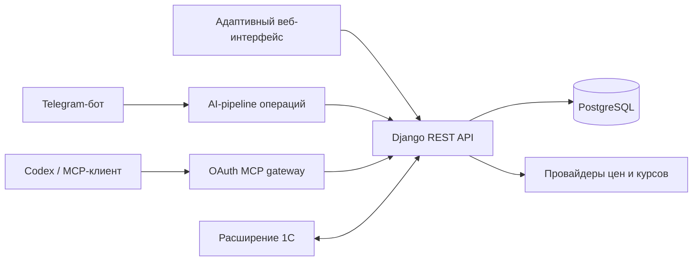

# FrontMoney

**Ваш собственный финансовый центр: ежедневные деньги, планирование, инвестиции и AI-автоматизация в одном приложении.**

[English](README.md) · [Русский](README.ru.md)

[С чего начать](docs/operations/server-runbook.md) · [Документация](docs/README.md) · [API](moneybackend/README.md) · [Инвестиционный модуль](docs/investment-module.md)

FrontMoney объединяет кошельки, бюджеты, регулярные платежи, инвестиционные портфели, отчёты и автоматизацию в одном приватном пространстве. Расход можно внести вручную, описать обычной фразой, отправить скриншот банка или поручить работу внешнему AI-агенту через защищённый MCP — во всех случаях действуют одни и те же финансовые правила.

## Зачем нужен FrontMoney

Большинство финансовых трекеров заканчиваются на категоризации операций. FrontMoney связывает весь процесс:

- **Показывает, где находятся деньги:** актуальные остатки по кошелькам и единый дашборд.
- **Помогает планировать заранее:** бюджеты, графики, проекты и регулярные платежи.
- **Превращает банковскую историю в учётные данные:** текст, скриншоты, голос и AI-классификация.
- **Отделяет инвестиции от бытовых расходов:** позиции, себестоимость, реализованная и нереализованная прибыль, целевые доли и аналитика ребалансировки.
- **Подключает внешних AI-агентов:** OAuth MCP-сервер с более чем 40 типизированными финансовыми инструментами.
- **Оставляет данные под вашим контролем:** полностью самостоятельное развёртывание в Docker.

## Главные возможности

### Ежедневный учёт денег

- Кошельки для карт, банковских счетов, наличных, долгов и любых пользовательских счетов.
- Приходы, расходы и переводы с проектами и иерархическими статьями движения денег.
- Текущие и исторические остатки.
- Бюджеты, исполнение бюджета, автоплатежи и графики платежей.
- Отчёты по движению денег и бюджетам с расшифровками и экспортом.
- Адаптивный веб-интерфейс со светлой и тёмной темами.

### AI-ассистент, который выполняет работу

- Запросы на естественном языке в веб-приложении.
- Распознавание одиночных операций и списков транзакций по банковским скриншотам.
- Осмысленные уточнения, если неоднозначны кошелёк, статья или дата.
- Умный веб-режим, который сам выбирает типизированные tools, читает реальные данные и выполняет цепочки действий.
- Серверный preview и обязательное подтверждение перед выполнением изменяющих tools.
- Защита от дублей и журнал решений AI.

### Работа через Telegram

- Добавление операций текстом, банковским скриншотом, голосовым или аудиосообщением.
- Предварительный просмотр структурированного результата до создания документов.
- Уточнения текстом и кнопками reply keyboard.
- Безопасная привязка Telegram к аккаунту через одноразовый код с коротким сроком жизни.
- Компактные отчёты по расходам и инвестициям без открытия веб-приложения.

### Аналитика инвестиционного портфеля

- Несколько портфелей и инвестиционных счетов.
- Покупка, продажа, корректировка и перевод активов между счетами.
- Позиции, средневзвешенная себестоимость, реализованный и нереализованный P&L, история доходности.
- Целевые доли и рекомендации по ребалансировке без автоматической торговли.
- Рыночные цены, историческая загрузка, валютные курсы и контроль свежести данных.
- Провайдеры CoinGecko и ЦБ РФ, а также ручной и тестовый режимы.

### MCP для внешних AI-агентов

FrontMoney содержит Streamable HTTP MCP-сервер по адресу `/mcp`:

- OAuth 2.1 Authorization Code + PKCE — секретный API-токен не нужно вставлять в промпт агента.
- Раздельные права `frontmoney.read` и `frontmoney.write`.
- Более 40 типизированных tools для кошельков, операций, бюджетов, отчётов, автоплатежей, инвестиций, рыночных данных и анализа портфеля.
- Аннотации чтения и записи, позволяющие совместимым клиентам запрашивать подтверждение перед изменениями.
- Адрес сервера и готовые инструкции доступны в **Настройки → Подключение через MCP**.

Подробности — в документе [Навыки агентов и MCP](docs/agent-skills.md).

### Интеграция с 1С и эксплуатационная надёжность

- Документированный контракт обмена с 1С, включая исходящую очередь изменений и подтверждение обработки.
- JWT для веб-приложения и отдельная token-аутентификация для 1С.
- Healthcheck каждого production-сервиса.
- Backup PostgreSQL, проверка восстановления, срок хранения и опциональная выгрузка на внешний сервер.
- Административные экраны для backup, сверки данных, регламентных заданий и состояния рыночных данных.
- Безопасное обновление сервера через fast-forward-only Git без удаления Docker volumes.

## Как устроена система



Все точки входа используют общие доменные правила и права пользователя. Веб-ассистент и Telegram готовят изменения к подтверждению; MCP-клиенты получают OAuth scopes и аннотации tools, чтобы применять собственную политику подтверждений.

## Технологии

| Слой | Стек |
| --- | --- |
| Web | Next.js 15, React, TypeScript, Tailwind CSS, TanStack Query, Zustand, Nivo |
| API | Django, Django REST Framework, OpenAPI, Simple JWT |
| AI | Мультимодальные модели OpenRouter, typed tool calling, опциональная транскрибация OpenAI |
| Агенты | MCP поверх Streamable HTTP, OAuth 2.1, PKCE, динамическая регистрация клиентов |
| Данные | PostgreSQL 14 |
| Инфраструктура | Docker Compose, Caddy, автоматический HTTPS, healthchecks |

## Структура репозитория

```text
frontmoney/       Веб-приложение Next.js
moneybackend/     Django API, AI-pipeline, MCP gateway и admin
docs/             Продуктовая, архитектурная и эксплуатационная документация
deploy/           Конфигурация Caddy и reverse proxy
docker-compose.yml
```

## С чего начать

Инструкции по развёртыванию намеренно вынесены из продуктового описания:

- **[Установка и эксплуатация на русском](docs/operations/server-runbook.md)**
- **[Deployment and operations guide in English](docs/operations/server-runbook.en.md)**

В runbook описаны требования, переменные окружения, HTTPS, первый запуск, создание администратора, Telegram, AI-провайдеры, регламентные задания, backup, restore-check, обновление и проверка работоспособности.

## Документация

- [Индекс документации](docs/README.md)
- [AI-ассистент и подтверждение операций](moneybackend/docs/ai_operations.md)
- [MCP и навыки агентов](docs/agent-skills.md)
- [Инвестиционный модуль](docs/investment-module.md)
- [Контракт синхронизации с 1С](moneybackend/docs/1c_extension_sync.md)
- [Паритет доменной модели с 1С](moneybackend/docs/domain_parity.md)
- [Backend API](moneybackend/README.md)
- [Ориентация по frontend](frontmoney/docs/project-orientation.md)

## Статус проекта

FrontMoney активно развивается как self-hosted приложение. Он подходит для контролируемого личного или небольшого командного развёртывания, где владелец управляет инфраструктурой, резервными копиями и ключами внешних провайдеров.

